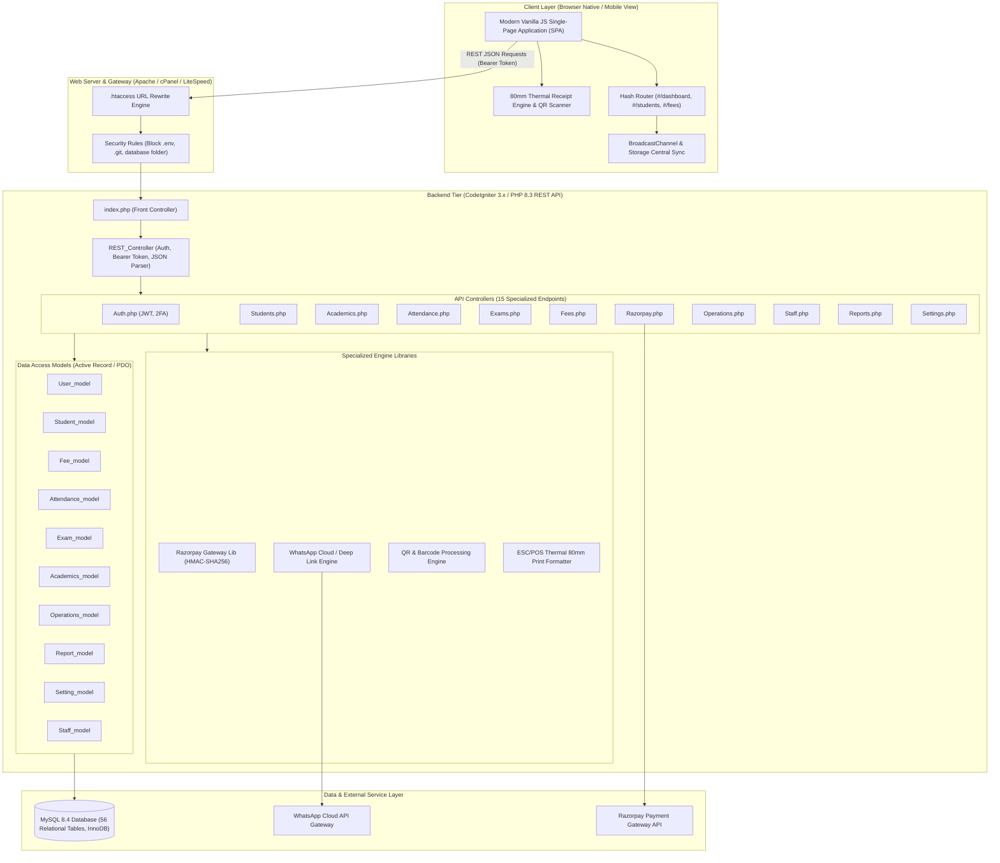
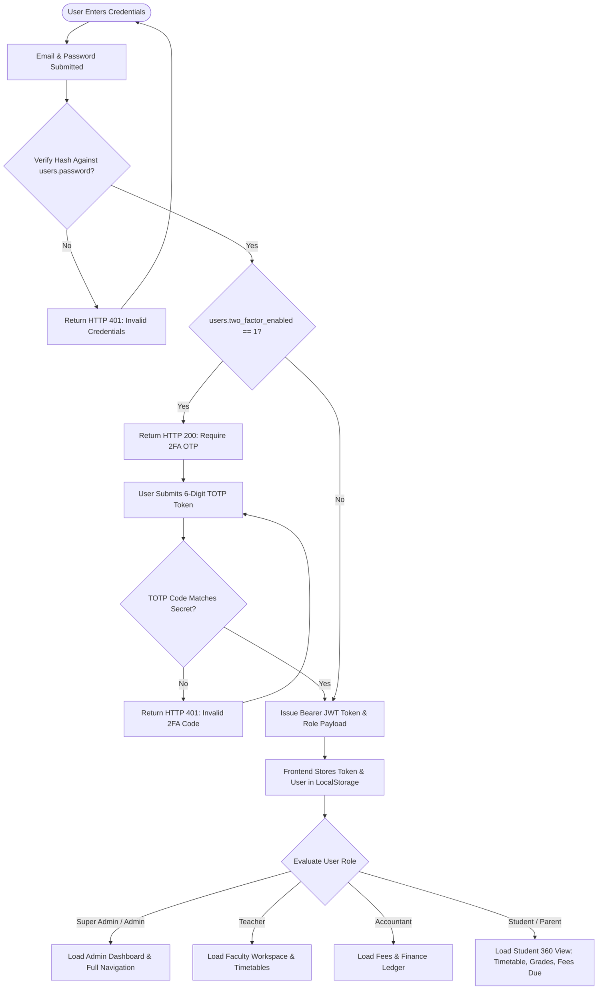
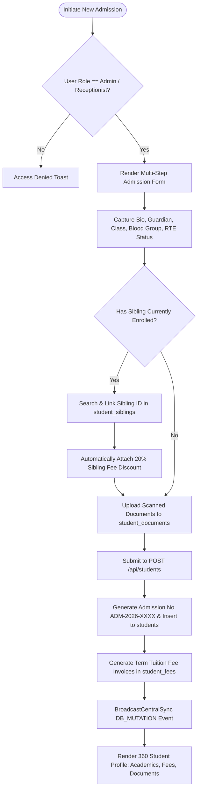
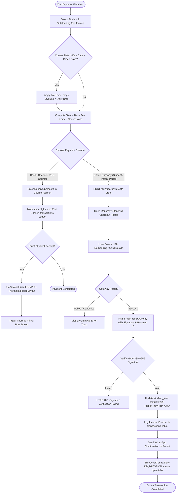
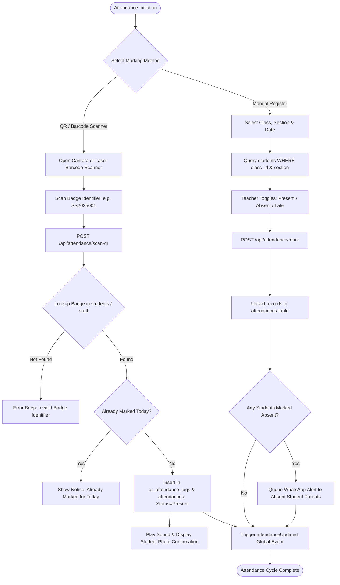

# SMART SCHOOL MANAGEMENT SYSTEM
## Enterprise Architecture, Flowcharts, ER Diagram & 45-Module Technical Specification Report

**Document Version:** 2026.1.0  
**Project:** Smart School – School Management System  
**Client / Specification:** Infosof Technologies 2026  
**Backend Framework:** CodeIgniter 3.x / PHP 8.x (Tested with PHP 8.3 & MySQL 8.4)  
**Frontend Architecture:** Modern HTML5 / CSS3 / Vanilla JavaScript Single Page Application (Zero Build Tools)  
**Database:** MySQL 8.x / 5.x (InnoDB, `utf8mb4_unicode_ci`, 56 Relational Tables)  

---

## 1. Executive Summary & System Overview

The **Smart School Management System** is an enterprise-grade school enterprise resource planning (ERP) platform designed to automate and streamline academic, administrative, financial, logistical, and communication operations across educational institutions.

### 1.1 Core Value Proposition
- **Full Operational Coverage:** Implements 45 discrete functional modules covering the entire student and staff lifecycle from initial admission inquiries to graduation and alumni tracking.
- **Lightweight, Zero-Build Frontend:** Built with browser-native JavaScript (ES6+), semantic HTML5, and responsive Vanilla CSS. It requires no Node.js compilation, npm bundling, or webpack/vite build steps, ensuring instant load times and effortless maintenance.
- **Enterprise PHP 8.x / CodeIgniter Backend:** High-speed RESTful JSON APIs running on CodeIgniter 3.x modernized for PHP 8.3, utilizing strict typing, PDO database abstractions, and token-based stateless security.
- **Multi-Tenant & Multi-Campus Ready:** Native support for multi-branch campus operations, dynamic session switching, and institutional customization.
- **Real-Time Multi-Tab Synchronization:** Integrated browser `BroadcastChannel` and `storage` event synchronization engine allowing changes made in one browser tab (such as attendance marking or fee payments) to reflect instantaneously across all open windows without manual refresh.

### 1.2 Role-Based Access Control (RBAC) Matrix
The system enforces strict permission checks across 8 distinct user roles:

| Role Name | Description & Primary Responsibilities | Scope of Access |
| :--- | :--- | :--- |
| **Super Admin** | System owner with unrestricted rights across all institutions and configuration. | Global (All 45 Modules, Database, Settings, 2FA, Multi-Campus) |
| **Admin** | School principal / senior administrative officer managing day-to-day operations. | School-wide (Academics, Staff, Finance, Students, Reports) |
| **Teacher** | Faculty members handling classroom instruction, homework, attendance, and grading. | Classroom Scope (Class Timetable, Attendance, Marks Entry, Live Classes) |
| **Accountant** | Financial officer managing fee collection, receipts, expenses, and ledgers. | Financial Scope (Fees Collection, Quick Fees, Expense Head, Thermal POS) |
| **Librarian** | Information officer managing book inventory, borrowing, and returns. | Library Operations (Catalog, Book Issues, Returns, Overdue Fines) |
| **Receptionist** | Front-desk staff handling visitor inquiries, student admissions, and phone calls. | Front Office (Admissions, Inquiries, Notices, Calendar) |
| **Student** | Enrolled learner viewing study materials, schedules, fee dues, and reports. | Self-Profile (View Timetable, Grades, Fees Due, Pay Online, Download Materials) |
| **Parent** | Guardian monitoring academic progress, attendance, and paying tuition fees. | Ward-Profile (Track Children, Attendance Alerts, Online Fee Clearance) |

---

## 2. System Architecture & Technical Stack

### 2.1 High-Level Architecture Diagram



### 2.2 Technical Stack Specifications
- **Operating Environment:** Windows, Linux, Ubuntu, cPanel (Shared & VPS Hosting).
- **Backend Framework:** CodeIgniter 3.x (PHP 8.3 compatible), strictly configured for RESTful JSON responses.
- **Frontend Stack:** HTML5, CSS3, ES6+ JavaScript, CSS Grid & Flexbox, SVG vector icons.
- **External Dependencies:** Zero npm dependencies, zero Node runtime dependencies for the frontend.
- **Payment Processing:** Official Razorpay Standard Checkout & Orders API with HMAC-SHA256 signature verification and simulated test sandbox.
- **Hardware Integration:** Standard 80mm ESC/POS thermal receipt printers (via window.print CSS styling) and Camera-based QR/Barcode scanning.

---

## 3. Complete 45-Module Functional Specification

Below is the exhaustive, feature-by-feature breakdown of all 45 modules certified under the Infosof Technologies 2026 specification:

```
+-----------------------------------------------------------------------------------------------+
|                             45 SYSTEM MODULES CLASSIFICATION MATRIX                           |
+-----------------------------------+-----------------------------------------------------------+
| 1. User & Role Management         | 24. Transfer Certificate (TC) Generator                  |
| 2. Admin Telemetry Dashboard      | 25. Admit Card & Hall Ticket Generator                    |
| 3. Student Admission Management   | 26. Annual Academic Calendar & Events                     |
| 4. 360° Comprehensive Student     | 27. Dynamic Custom Fields Builder                         |
| 5. Multi-Criteria Student Search  | 28. QR Code / Barcode Attendance Scanner                  |
| 6. Student Session Promotion      | 29. Two-Factor Authentication (2FA TOTP)                  |
| 7. Caste & Category Allocation    | 30. Behavior Records & Merit/Demerit Logging              |
| 8. Fees Management & Invoicing    | 31. Thermal 80mm POS Receipt Printing                     |
| 9. Income & Expense Ledgers       | 32. Quick Fee Creation & Counter Cash Entry               |
| 10. Daily Attendance Roll Call    | 33. Automatic Overdue Fine Calculation Engine             |
| 11. Examination & CBSE 9-Point    | 34. Fee Concession & Discount Management                  |
| 12. Class & Section Management    | 35. Online Payment Processing (Razorpay Gateway)          |
| 13. Weekly Class Timetable Matrix | 36. Executive Analytics & Comprehensive Reports           |
| 14. Download Center (E-Learning)  | 37. Multi-School & Multi-Campus Switching                 |
| 15. Library Catalog & Book Issues | 38. Mobile Application REST Gateway                       |
| 16. Transport & Vehicle Tracking  | 39. Front Website Public Portal & WhatsApp Chat Widget    |
| 17. Hostel Wing & Room Allotment  | 40. Academic Session Transition & Rollover                |
| 18. Notice Board & Announcements  | 41. Student Digital Document Vault                        |
| 19. WhatsApp Messaging Automation | 42. Sibling Linking & Family Account Tree                 |
| 20. Live Classes (Zoom / Meet)    | 43. RTE (Right to Education) Quota Management             |
| 21. Staff Directory & HR Profiles | 44. Institutional Profile & Global System Settings        |
| 22. Staff Attendance & Punch Logs | 45. Modern PHP 8.x / CodeIgniter Core Architecture        |
| 23. Automated Student CV Engine   |                                                           |
+-----------------------------------+-----------------------------------------------------------+
```

### Module 01: User & Role Management
- **Description:** Centralized identity and privilege governance system.
- **Capabilities:** Supports 8 standardized user roles (`super_admin`, `admin`, `teacher`, `accountant`, `librarian`, `receptionist`, `student`, `parent`). Supports role assignment, granular module permissions, account disabling, and password reset.
- **Endpoints:** `GET /api/users`, `POST /api/users`, `PUT /api/users/:id`, `DELETE /api/users/:id`, `GET /api/users/roles`.
- **Database Tables:** `users`, `permissions`, `role_permissions`, `sessions`.

### Module 02: Admin Telemetry Dashboard
- **Description:** Real-time operational intelligence mission control.
- **Capabilities:** Displays high-priority telemetry cards (Total Students, Staff Count, Fee Collected vs Pending, Attendance Percentages), quick action shortcuts, recent notices, cash flow charts, and pending approvals.
- **Endpoints:** `GET /api/dashboard/stats`, `GET /api/dashboard/charts`.
- **Database Tables:** Aggregates `students`, `staff`, `student_fees`, `attendances`, `transactions`, `notices`.

### Module 03: Student Admission Management
- **Description:** Formal student enrollment and onboarding pipeline.
- **Capabilities:** Multi-tab registration capture including personal information, Aadhaar/ID, guardian details, address, previous school history, blood group, medical alerts, admission date, and auto-generated Admission Number (`ADM-YYYY-XXXX`).
- **Endpoints:** `POST /api/students`, `GET /api/students/next-admission-no`.
- **Database Tables:** `students`, `student_documents`, `student_custom_field_values`.

### Module 04: 360° Comprehensive Student Profile
- **Description:** Holistic student dossier providing a single-pane-of-glass overview.
- **Capabilities:** Consolidates attendance rates, fee balances, fee receipts history, exam report cards, behavioral incident history, parent contact details, documents vault, sibling relationships, hostel allocation, and transport stops.
- **Endpoints:** `GET /api/students/profile/:id`, `GET /api/students/:id`.
- **Database Tables:** `students`, `attendances`, `student_fees`, `exam_results`, `student_notes`, `student_transports`, `student_hostels`.

### Module 05: Multi-Criteria Student Search
- **Description:** Fast parametric query engine for retrieving student cohorts.
- **Capabilities:** Real-time debounce search matching by name, admission number, roll number, father's mobile number, class, section, gender, and category.
- **Endpoints:** `GET /api/students?query=...&class_id=...&section=...`.
- **Database Tables:** `students` (indexed on `admission_no`, `first_name`, `last_name`, `phone`).

### Module 06: Student Session Promotion
- **Description:** Academic year progression and batch rollover engine.
- **Capabilities:** Promotes students from one class/section to the next academic session based on academic standing (Pass / Retain). Preserves historical promotion logs with previous class and section records.
- **Endpoints:** `POST /api/academics/promote-students`.
- **Database Tables:** `student_promotions`, `students`, `academic_sessions`.

### Module 07: Caste & Category Allocation
- **Description:** Institutional demographic categorization and diversity compliance.
- **Capabilities:** Classifies learners into standardized regulatory categories (`General`, `OBC`, `SC`, `ST`, `EWS`, `Physically Challenged`). Enables state scholarship reports and quota verification.
- **Endpoints:** `GET /api/students/categories`.
- **Database Tables:** `students.category`.

### Module 08: Fees Management & Invoicing
- **Description:** End-to-end fee structure, billing, and accounting suite.
- **Capabilities:** Configures multi-term fee types (Tuition, Laboratory, Annual, Transport, Sports). Generates digital fee invoices, issues unique receipt numbers, tracks partial payments, overdue balances, and historical ledgers.
- **Endpoints:** `GET /api/fees/types`, `POST /api/fees/collect`, `GET /api/fees/student/:id`.
- **Database Tables:** `fee_types`, `student_fees`, `transactions`.

### Module 09: Income & Expense Ledgers
- **Description:** General ledger and institutional cash flow management.
- **Capabilities:** Manages double-entry account heads (School Fee, Grants, Canteen, Repairs, Utility Bills, Salaries). Records income and expense vouchers with payment mode, attachments, and date stamps.
- **Endpoints:** `GET /api/finance/transactions`, `POST /api/finance/transactions`, `GET /api/finance/summary`.
- **Database Tables:** `accounts_heads`, `transactions`.

### Module 10: Daily Attendance Roll Call
- **Description:** Classroom roll-call register and attendance reporting.
- **Capabilities:** Bulk daily marking interface (Present, Absent, Late, Half Day, Holiday). Instant attendance summary calculation, percentage tracking, and automated absence alert generation.
- **Endpoints:** `GET /api/attendance/daily`, `POST /api/attendance/mark`, `GET /api/attendance/report`.
- **Database Tables:** `attendances`, `students`, `school_classes`.

### Module 11: Examination Management & CBSE 9-Point Grading
- **Description:** Examination scheduler, marks capture, and grading engine.
- **Capabilities:** Configures terms (Unit Test, Half Yearly, Annual), subjects, maximum and passing marks. Automatically computes percentages, ranks, and assigns official CBSE 9-point letter grades (`A1`, `A2`, `B1`, `B2`, `C1`, `C2`, `D`, `E1`, `E2`).
- **Endpoints:** `GET /api/exams`, `POST /api/exams/marks`, `GET /api/exams/report-card/:student_id/:exam_id`.
- **Database Tables:** `exams`, `exam_schedules`, `exam_results`.

### Module 12: Academic Class & Section Management
- **Description:** Institutional academic division configuration.
- **Capabilities:** Configures classes (e.g., Nursery to Class 12), sections (A, B, C, D), assigns dedicated Class Teachers, room numbers, and subject curricula.
- **Endpoints:** `GET /api/academics/classes`, `POST /api/academics/classes`, `GET /api/academics/subjects`.
- **Database Tables:** `school_classes`, `subjects`, `class_subjects`.

### Module 13: Weekly Class Timetable Matrix
- **Description:** Multi-period weekly scheduling grid.
- **Capabilities:** Allocates subjects, start/end period times, and assigned faculty across Monday through Saturday. Prevents teacher scheduling clashes.
- **Endpoints:** `GET /api/academics/timetable?class_id=...&section=...`, `POST /api/academics/timetable`.
- **Database Tables:** `timetables`, `school_classes`, `subjects`, `staff`.

### Module 14: Download Center (E-Learning Repository)
- **Description:** Digital educational resource and syllabus depository.
- **Capabilities:** Enables teachers to upload syllabus documents, weekly assignments, past exam question papers, and study materials classified by class and subject with secure file downloads.
- **Endpoints:** `GET /api/academics/downloads`, `POST /api/academics/downloads`.
- **Database Tables:** `download_materials`.

### Module 15: Library Management & Book Circulation
- **Description:** Integrated library cataloging and circulation desk.
- **Capabilities:** Tracks book inventory by title, author, ISBN, publisher, rack number, total vs available copies. Handles book issue and return workflows for students and staff with automatic overdue fine calculation.
- **Endpoints:** `GET /api/operations/library/books`, `POST /api/operations/library/issue`, `POST /api/operations/library/return`.
- **Database Tables:** `library_books`, `book_issues`.

### Module 16: Transport Management & Route Stops
- **Description:** Fleet logistics, vehicle registration, and student route allocation.
- **Capabilities:** Registers school buses and vans, driver names, phone numbers, route itineraries, and designated pickup/drop-off stops with exact timings and monthly transport fees.
- **Endpoints:** `GET /api/operations/transport/routes`, `POST /api/operations/transport/assign`.
- **Database Tables:** `transport_routes`, `transport_stops`, `student_transports`.

### Module 17: Hostel Management & Room Allocation
- **Description:** Boarding house governance and student room allotment.
- **Capabilities:** Manages hostel buildings (Boys, Girls, Junior, Senior), room types (AC, Non-AC, Single, Shared), intake capacity, current vacancies, and room allotment ledger.
- **Endpoints:** `GET /api/operations/hostel/wings`, `POST /api/operations/hostel/assign`.
- **Database Tables:** `hostels`, `hostel_rooms`, `student_hostels`.

### Module 18: Notice Board & Communications Hub
- **Description:** Omnichannel circular broadcasting and communications center.
- **Capabilities:** Publishes official notices, alerts, and academic circulars with targeted audience scope (`All`, `Students`, `Parents`, `Staff`). Role-guarded so students cannot publish circulars.
- **Endpoints:** `GET /api/operations/notices`, `POST /api/operations/notices`, `DELETE /api/operations/notices/:id`.
- **Database Tables:** `notices`.

### Module 19: WhatsApp Messaging Integration
- **Description:** Automated and interactive WhatsApp notifications engine.
- **Capabilities:** Generates instant WhatsApp communication deep links (`https://wa.me/...`) and backend notification payloads for fee due reminders, absence alerts, examination hall tickets, and circulars.
- **Endpoints:** `POST /api/operations/whatsapp/send`.
- **Libraries & Tables:** `Whatsapp_lib.php`, `notification_logs`.

### Module 20: Online Classes / Live Classes
- **Description:** Distance learning and virtual classroom scheduler.
- **Capabilities:** Integrates Zoom and Google Meet session links with meeting IDs, passcodes, scheduled dates, durations, and direct student launch buttons.
- **Endpoints:** `GET /api/academics/live-classes`, `POST /api/academics/live-classes`.
- **Database Tables:** `live_classes`.

### Module 21: Staff Management & Human Resources
- **Description:** Comprehensive faculty and employee master directory.
- **Capabilities:** Records employee IDs (`EMP-XXXX`), designations, departments, academic qualifications, joining dates, emergency contacts, bank account details, and basic salary structures.
- **Endpoints:** `GET /api/staff`, `POST /api/staff`, `GET /api/staff/:id`.
- **Database Tables:** `staff`, `salary_records`, `payslip_items`.

### Module 22: Staff Attendance & Punch Logs
- **Description:** Employee attendance and working hour tracking.
- **Capabilities:** Records daily staff presence, punch-in time, punch-out time, half days, and leave applications with approval status.
- **Endpoints:** `GET /api/staff/attendance`, `POST /api/staff/attendance/mark`.
- **Database Tables:** `staff_attendances`, `leave_applications`.

### Module 23: Automated Student Curriculum Vitae (CV) Engine
- **Description:** Auto-generated student academic and co-curricular resume.
- **Capabilities:** Compiles student bio, educational history, extracurricular awards, sports participation, disciplinary record, and attendance percentage into a printable curriculum vitae.
- **Endpoints:** `GET /api/students/:id/cv`.
- **Database Tables:** `students`, `exam_results`, `student_notes`, `student_timelines`.

### Module 24: Transfer Certificate (TC) Generator
- **Description:** Formal CBSE / State Board compliant Transfer Certificate issuance.
- **Capabilities:** Generates serialized official school leaving certificates (`TC-YYYY-XXXX`) including student details, date of admission, date of leaving, reason for departure, conduct assessment, and digital signature boxes.
- **Endpoints:** `GET /api/students/:id/tc`, `POST /api/students/:id/issue-tc`.
- **Database Tables:** `students`, `school_settings`.

### Module 25: Examination Admit Card (Hall Ticket)
- **Description:** Examination entry pass and hall ticket generator.
- **Capabilities:** Produces printable hall tickets containing student photo, roll number, class & section, exam schedule matrix (dates, subjects, room numbers), and examination conduct guidelines.
- **Endpoints:** `GET /api/exams/admit-card?exam_id=...&student_id=...`.
- **Database Tables:** `exams`, `exam_schedules`, `students`.

### Module 26: Annual Academic Calendar & Events
- **Description:** Centralized institutional event and holiday planner.
- **Capabilities:** Schedules term examinations, sports days, cultural festivals, public holidays, and parent-teacher meetings with visual color coding and dashboard timeline widgets.
- **Endpoints:** `GET /api/academics/calendar`, `POST /api/academics/calendar`.
- **Database Tables:** `calendar_events`.

### Module 27: Dynamic Custom Fields Builder
- **Description:** Schema extension engine for custom institutional data capture.
- **Capabilities:** Allows administrators to define dynamic custom form fields (Text, Number, Date, Select Dropdown, Checkbox) attached to the Student Admission or Staff Creation forms without touching SQL code.
- **Endpoints:** `GET /api/settings/custom-fields`, `POST /api/settings/custom-fields`.
- **Database Tables:** `custom_fields`, `student_custom_field_values`.

### Module 28: QR Code / Barcode Attendance Scanner
- **Description:** Rapid badge scanning attendance engine.
- **Capabilities:** Utilizes camera feed or USB laser barcode/QR scanners to decode student/staff ID cards (`SS2025001`), instantly recording attendance and logging timestamps.
- **Endpoints:** `POST /api/attendance/scan-qr`.
- **Libraries & Tables:** `Qr_lib.php`, `qr_attendance_logs`, `attendances`.

### Module 29: Two-Factor Authentication (2FA)
- **Description:** Enhanced cryptographic login security.
- **Capabilities:** Supports Time-Based One-Time Password (TOTP) standard (RFC 6238) compatible with Google Authenticator, Microsoft Authenticator, and Authy.
- **Endpoints:** `POST /api/auth/2fa-setup`, `POST /api/auth/2fa-verify`.
- **Database Tables:** `users.two_factor_secret`, `users.two_factor_enabled`.

### Module 30: Behavior Records & Disciplinary Tracking
- **Description:** Student conduct, merit, and demerit monitoring.
- **Capabilities:** Records behavioral incidents tagged as `Merit` (academic excellence, leadership, honesty) or `Demerit` (truancy, disobedience, uniform violation) with severity levels, dates, and reporter notes.
- **Endpoints:** `GET /api/students/:id/behavior`, `POST /api/students/:id/behavior`.
- **Database Tables:** `student_notes`.

### Module 31: Thermal 80mm POS Receipt Printing
- **Description:** Point-of-sale receipt formatting for physical counter collections.
- **Capabilities:** Formats fee payment receipts according to 80mm thermal paper geometry (character wrapping, school header, receipt number, breakdown, and cashier signature lines).
- **Endpoints:** `GET /api/fees/receipt/:id/thermal`.
- **Libraries:** `Thermal_lib.php`.

### Module 32: Quick Fee Creation & Counter Entry
- **Description:** Rapid fee billing and counter collection interface.
- **Capabilities:** Enables cashiers to issue an impromptu fee invoice (e.g., picnic fee, uniform fee, replacement ID) and immediately collect cash in a single streamlined screen.
- **Endpoints:** `POST /api/fees/quick-create`.
- **Database Tables:** `student_fees`, `transactions`.

### Module 33: Automatic Overdue Fine Calculation Engine
- **Description:** Rule-based late fee calculation engine.
- **Capabilities:** Evaluates invoice due dates against current dates; computes overdue days past the configured grace period, applying fixed daily fines (e.g., ₹20/day) or percentage penalties to outstanding dues.
- **Endpoints:** `GET /api/fees/calculate-fine`.
- **Database Tables:** `fee_types.fine_amount`, `student_fees`.

### Module 34: Fee Concession & Discount Management
- **Description:** Institutional scholarship and fee waiver system.
- **Capabilities:** Configures discount rules including Sibling Concession (20%), RTE 100% waiver, Merit scholarship (25%), and Staff ward discount (50%), automatically adjusting net payable amounts.
- **Endpoints:** `GET /api/fees/discounts`, `POST /api/fees/apply-discount`.
- **Database Tables:** `fee_discounts`, `student_fees`.

### Module 35: Online Payment Processing (Razorpay Gateway)
- **Description:** Automated digital fee collection infrastructure.
- **Capabilities:** Seamlessly generates Razorpay Orders via REST API, renders the Razorpay Standard Checkout popup, handles UPI/Cards/Netbanking, verifies cryptographic HMAC-SHA256 signatures, and records instant ledger receipts.
- **Endpoints:** `POST /api/razorpay/create-order`, `POST /api/razorpay/verify`, `POST /api/razorpay/webhook`.
- **Database Tables:** `student_fees`, `transactions`, `school_settings`.

### Module 36: Executive Analytics & Audit Reports
- **Description:** Comprehensive analytical reporting hub.
- **Capabilities:** Generates exportable reports: Student Demographics (Gender/Category distribution), Financial Audit (Income vs Expense vs Net Surplus), Fee Collection Defaulters List, and Academic Performance Matrix.
- **Endpoints:** `GET /api/reports/students`, `GET /api/reports/financial`, `GET /api/reports/exams`.
- **Database Tables:** Aggregates `students`, `transactions`, `student_fees`, `exam_results`.

### Module 37: Multi-School & Multi-Campus Capability
- **Description:** Multi-tenant institution management.
- **Capabilities:** Supports institutional branch networks (e.g., Main City Campus, West Campus, International Campus) with tenant-isolated classes, fee structures, and staff rosters.
- **Endpoints:** `GET /api/settings/campuses`, `POST /api/settings/switch-campus`.
- **Database Tables:** `school_settings.available_campuses`, `school_settings.current_campus`.

### Module 38: Mobile Application REST Gateway
- **Description:** High-efficiency API layer for Android & iOS client applications.
- **Capabilities:** Delivers lightweight, compressed JSON payloads tailored for the Smart School Mobile App v5.0, supporting offline caching, push notifications, and biometric app unlock.
- **Endpoints:** `GET /api/mobile/sync`, `POST /api/mobile/push-token`.
- **Database Tables:** `personal_access_tokens`, `notification_logs`.

### Module 39: Front Website Public Portal & WhatsApp Chat Widget
- **Description:** Public landing page and prospective student inquiry funnel.
- **Capabilities:** Features public information (courses, facilities, faculty, school calendar), an online inquiry submission form, and a floating interactive WhatsApp chat widget.
- **Endpoints:** `POST /api/website/inquiry`, `GET /api/website/notices`.
- **Database Tables:** `notices`, `school_settings`.

### Module 40: Academic Session Transition & Rollover
- **Description:** Institutional academic calendar demarcations.
- **Capabilities:** Manages session transitions (e.g., `2024-2025`, `2025-2026`, `2026-2027`), setting the active operational year while preserving historical archives for prior sessions.
- **Endpoints:** `GET /api/academics/sessions`, `POST /api/academics/sessions/activate`.
- **Database Tables:** `academic_sessions`.

### Module 41: Student Digital Document Vault
- **Description:** Digital document archival and verification repository.
- **Capabilities:** Securely stores scanned attachments (Birth Certificate, Transfer Certificate, Aadhaar Card, Immunization Records, Previous Marksheets) linked directly to the student record.
- **Endpoints:** `POST /api/students/:id/documents`, `GET /api/students/:id/documents`.
- **Database Tables:** `student_documents`.

### Module 42: Sibling Linking & Family Account Tree
- **Description:** Family relationship graph and automatic concession association.
- **Capabilities:** Connects siblings enrolled in the same institution. Displays linked brothers/sisters in the 360° profile and automatically activates sibling fee discount rules for younger children.
- **Endpoints:** `GET /api/students/:id/siblings`, `POST /api/students/:id/link-sibling`.
- **Database Tables:** `student_siblings`.

### Module 43: RTE (Right to Education) Quota Records
- **Description:** Government RTE compliance and quota reporting.
- **Capabilities:** Flags RTE admissions, tracks documentation, waives standard tuition fees in accordance with statutory guidelines, and generates RTE audit summaries for education departments.
- **Endpoints:** `GET /api/students/rte-list`.
- **Database Tables:** `students.rte`.

### Module 44: Institutional Profile & Global System Settings
- **Description:** Global school branding, localization, and system configuration.
- **Capabilities:** Configures school name, motto, official address, contact emails, currency symbol (₹, $, €, £), receipt numbering prefixes (`REC-`, `TC-`), Razorpay API keys, and institution logo upload.
- **Endpoints:** `GET /api/settings`, `POST /api/settings`.
- **Database Tables:** `school_settings`.

### Module 45: Modern PHP 8.x / CodeIgniter Core Architecture
- **Description:** Enterprise server foundation and performance engine.
- **Capabilities:** Refactored for PHP 8.3 compatibility, parameterized PDO queries protecting against SQL injection, strict input sanitization, and automated 45-module test runner execution.
- **Verification:** Passes automated suite (`test_ci_all_45_modules.php` - 45 / 45 tests, 100% success rate).

---

## 4. Comprehensive System Flowcharts

### 4.1 Flowchart 1: User Authentication, Session & 2FA Flow



### 4.2 Flowchart 2: Student Admission & 360° Profile Lifecycle Flow



### 4.3 Flowchart 3: Fee Billing, Fine Calculation & Razorpay Online Payment Flow



### 4.4 Flowchart 4: Attendance Roll Call (Manual & QR Scan) Flow



### 4.5 Flowchart 5: Examination, Marks Entry & CBSE Report Card Flow

```mermaid
flowchart TD
    EXAM_START([Examination Workflow]) --> CREATE_EXAM[Configure Exam Term: Name, Term, Session]
    CREATE_EXAM --> SCHED[Create Exam Schedules: Class, Subject, Date, Room, Max Marks]
    SCHED --> ADMIT_GEN[Generate Printable Student Admit Cards / Hall Tickets]
    ADMIT_GEN --> EXAM_HELD[Examinations Conducted]
    
    EXAM_HELD --> MARKS_ENTRY[Faculty Opens Marks Entry: Select Exam, Class, Subject]
    MARKS_ENTRY --> ENTER_MARKS[Input Theory & Practical Marks per Student]
    ENTER_MARKS --> POST_MARKS[POST /api/exams/marks]
    POST_MARKS --> DB_MARKS[Store in exam_results Table]
    
    DB_MARKS --> CALC_GRADE[Exam_model Calculates Totals, Percentages & CBSE Grades]
    CALC_GRADE --> GRADE_SCALE{Score Percentage}
    
    GRADE_SCALE -- "91% to 100%" --> G_A1[Grade A1 (Grade Point 10.0)]
    GRADE_SCALE -- "81% to 90%" --> G_A2[Grade A2 (Grade Point 9.0)]
    GRADE_SCALE -- "71% to 80%" --> G_B1[Grade B1 (Grade Point 8.0)]
    GRADE_SCALE -- "61% to 70%" --> G_B2[Grade B2 (Grade Point 7.0)]
    GRADE_SCALE -- "51% to 60%" --> G_C1[Grade C1 (Grade Point 6.0)]
    GRADE_SCALE -- "41% to 50%" --> G_C2[Grade C2 (Grade Point 5.0)]
    GRADE_SCALE -- "33% to 40%" --> G_D[Grade D (Grade Point 4.0)]
    GRADE_SCALE -- "< 33%" --> G_E[Grade E - Needs Improvement]
    
    G_A1 & G_A2 & G_B1 & G_B2 & G_C1 & G_C2 & G_D & G_E --> COMPOSE_CARD[Assemble Comprehensive Report Card]
    COMPOSE_CARD --> PUBLISH_REPORT([Report Card Ready for View, Download & WhatsApp Sharing])
```

---

## 5. Entity-Relationship (ER) Diagram & Database Schema

The database consists of **56 relational tables** utilizing the MySQL InnoDB storage engine with full UTF-8 (`utf8mb4_unicode_ci`) character set support.

### 5.1 High-Level Entity-Relationship (ER) Diagram

```mermaid
erDiagram
    users ||--o{ sessions : "establishes"
    users ||--o{ messages : "sends_and_receives"
    users ||--o{ personal_access_tokens : "authenticates"
    role_permissions }o--|| permissions : "grants"

    school_classes ||--o{ students : "enrolls"
    school_classes ||--o{ class_subjects : "teaches"
    school_classes ||--o{ timetables : "schedules"
    school_classes ||--o{ attendances : "takes"
    school_classes ||--o{ exam_schedules : "assigns"

    subjects ||--o{ class_subjects : "categorized_in"
    subjects ||--o{ timetables : "allocated_in"
    subjects ||--o{ exam_schedules : "tested_in"

    students ||--o{ attendances : "records"
    students ||--o{ student_fees : "billed"
    students ||--o{ fee_discounts : "receives"
    students ||--o{ exam_results : "scores"
    students ||--o{ student_documents : "stores"
    students ||--o{ student_siblings : "linked_to"
    students ||--o{ student_notes : "logged_for"
    students ||--o{ student_promotions : "progressed"
    students ||--o{ student_transports : "allocated"
    students ||--o{ student_hostels : "accommodated"
    students ||--o{ book_issues : "borrows"

    staff ||--o{ staff_attendances : "punches"
    staff ||--o{ salary_records : "compensated"
    staff ||--o{ book_issues : "borrows"
    staff ||--o{ class_subjects : "instructs"
    salary_records ||--o{ payslip_items : "itemized_into"

    fee_types ||--o{ fee_discounts : "deducts"
    accounts_heads ||--o{ transactions : "categorizes"
    student_fees ||--o{ transactions : "clears_through"

    exams ||--o{ exam_schedules : "contains"
    exams ||--o{ exam_results : "evaluated_in"

    library_books ||--o{ book_issues : "circulates"

    transport_routes ||--o{ transport_stops : "stops_at"
    transport_routes ||--o{ student_transports : "transports"
    transport_stops ||--o{ student_transports : "boards"

    hostels ||--o{ hostel_rooms : "contains"
    hostels ||--o{ student_hostels : "houses"
    hostel_rooms ||--o{ student_hostels : "resides_in"

    custom_fields ||--o{ student_custom_field_values : "stores"
```



### 5.2 Key Database Entities & Data Dictionary

#### 1. `students` (Student Master Dossier)
| Column Name | Data Type | Key / Constraint | Description |
| :--- | :--- | :--- | :--- |
| `id` | bigint unsigned | **PK, Auto Increment** | Unique internal student identifier |
| `admission_no` | varchar(255) | **Unique** | Official institutional admission serial (e.g. ADM-2025-001) |
| `first_name` | varchar(255) | Not Null | Student's given first name |
| `last_name` | varchar(255) | Nullable | Student's family surname |
| `dob` | date | Not Null | Date of birth |
| `gender` | enum('Male','Female','Other') | Not Null | Biological gender |
| `class_id` | bigint unsigned | **FK -> school_classes(id)** | Currently assigned academic class |
| `section` | varchar(50) | Not Null | Assigned class section (A, B, C, D) |
| `roll_no` | varchar(50) | Nullable | Classroom roll number |
| `father_name` | varchar(255) | Nullable | Primary male guardian name |
| `father_phone` | varchar(50) | Nullable | Guardian primary contact number |
| `category` | varchar(50) | Default 'General' | Social demographic category (General, OBC, SC, ST, EWS) |
| `rte` | enum('Yes','No') | Default 'No' | Right to Education government quota status |
| `status` | enum('Active','Inactive','Alumni')| Default 'Active' | Enrollment operational status |

#### 2. `student_fees` (Financial Billing Ledger)
| Column Name | Data Type | Key / Constraint | Description |
| :--- | :--- | :--- | :--- |
| `id` | bigint unsigned | **PK, Auto Increment** | Primary fee invoice identifier |
| `receipt_no` | varchar(100) | **Unique** | Official payment receipt serial (e.g. REC-2026-0001, RZP-XXXX) |
| `student_id` | bigint unsigned | **FK -> students(id)** | Target student reference |
| `type` | varchar(255) | Not Null | Fee category (Tuition, Transport, Exam, Annual) |
| `amount` | decimal(10,2) | Not Null | Gross assessed invoice amount |
| `paid` | decimal(10,2) | Default 0.00 | Actual collected amount |
| `status` | enum('Paid','Partial','Pending')| Default 'Pending' | Settlement status |
| `due_date` | date | Not Null | Payment deadline before late fine kicks in |
| `payment_mode` | varchar(100) | Nullable | Cash, Cheque, UPI, Razorpay Online Gateway |
| `razorpay_order_id`| varchar(255) | Nullable | Gateway generated order identifier |
| `razorpay_payment_id`| varchar(255)| Nullable | Gateway generated payment transaction hash |

#### 3. `attendances` (Student Daily Attendance)
| Column Name | Data Type | Key / Constraint | Description |
| :--- | :--- | :--- | :--- |
| `id` | bigint unsigned | **PK, Auto Increment** | Roll call record identifier |
| `student_id` | bigint unsigned | **FK -> students(id)** | Enrolled student reference |
| `class_id` | bigint unsigned | **FK -> school_classes(id)** | Academic class reference |
| `date` | date | Not Null | Date of roll call |
| `status` | enum('Present','Absent','Late','Half Day')| Not Null | Attendance outcome |
| `remark` | text | Nullable | Reason for absence or medical note |

#### 4. `exam_results` (Academic Scores & Grades)
| Column Name | Data Type | Key / Constraint | Description |
| :--- | :--- | :--- | :--- |
| `id` | bigint unsigned | **PK, Auto Increment** | Result record identifier |
| `student_id` | bigint unsigned | **FK -> students(id)** | Enrolled student reference |
| `exam` | varchar(255) | Not Null | Examination term title (Half Yearly, Annual) |
| `subject` | varchar(255) | Not Null | Course subject title |
| `marks` | decimal(5,2) | Not Null | Marks secured by student |
| `max_marks` | decimal(5,2) | Default 100.00 | Maximum possible subject marks |
| `grade` | varchar(10) | Not Null | CBSE 9-Point grade computed by system (A1-E) |

#### 5. `transactions` (General Institutional Cash Ledger)
| Column Name | Data Type | Key / Constraint | Description |
| :--- | :--- | :--- | :--- |
| `id` | bigint unsigned | **PK, Auto Increment** | Ledger transaction identifier |
| `type` | enum('Income','Expense')| Not Null | Financial cash flow direction |
| `accounts_head_id`| bigint unsigned | **FK -> accounts_heads(id)** | Accounting budget category |
| `head` | varchar(255) | Not Null | Nominal account title |
| `amount` | decimal(10,2) | Not Null | Transaction currency value |
| `date` | date | Not Null | Posting date |
| `payment_mode` | varchar(50) | Default 'Cash' | Cash, Bank Transfer, Razorpay |
| `reference_no` | varchar(100) | Nullable | Check number, voucher ID, or receipt reference |

#### 6. `school_settings` (Global Institutional Configuration)
| Column Name | Data Type | Key / Constraint | Description |
| :--- | :--- | :--- | :--- |
| `id` | bigint unsigned | **PK, Auto Increment** | Single row institutional master |
| `school_name` | varchar(255) | Not Null | Official school legal name |
| `tagline` | varchar(255) | Nullable | Institutional motto or secondary line |
| `currency_symbol` | varchar(10) | Default '₹' | Financial display currency |
| `receipt_prefix` | varchar(20) | Default 'REC-' | Prefix for counter receipts |
| `razorpay_enabled` | tinyint(1) | Default 1 | Gateway toggle flag |
| `razorpay_key_id` | varchar(255) | Nullable | Public API Key ID for Razorpay |
| `razorpay_key_secret`| varchar(255)| Nullable | Secret API Key for HMAC verification |
| `current_campus` | varchar(100) | Default 'Main Campus' | Active operating institution campus |

---

## 6. Security, Deployment & Operational Readiness

### 6.1 Security Architecture
1. **Password Encryption:** Passwords are hashed using PHP's native `PASSWORD_BCRYPT` with high salt work factors.
2. **SQL Injection Defense:** All queries in CodeIgniter models utilize PDO parameterized binding. Raw query string concatenation is strictly prohibited.
3. **Cross-Site Scripting (XSS) Sanitization:** All incoming requests are filtered; output escaping is applied across frontend templates.
4. **Role Guards:** UI routes, buttons, and API endpoints are double-guarded using role permission checks (e.g., student roles cannot view or trigger the "Post New Circular" or "Collect Fee" actions).
5. **Cryptographic Payment Integrity:** Razorpay webhook and checkout callbacks are verified via HMAC-SHA256 signature verification preventing payment tampering.

### 6.2 Deployment Topology (cPanel / Apache / Linux)
The system is optimized for direct deployment to cPanel shared hosting or dedicated Linux environments:
- **Root Directory:** Contains `.htaccess` which routes API requests to `/backend_codeigniter/` while preserving root static access to `/frontend/index.html`.
- **Security Headers:** The `.htaccess` file prevents public web traversal into `.env`, `.git`, or the raw SQL `/database/` dump folder.
- **Database Import:** Single-click import via phpMyAdmin or command line MySQL using `smart_school_database_cpanel_2026.sql`.
- **Zero Build Maintenance:** No Node.js runtime, npm installs, or build scripts are needed on the hosting server.

---

## 7. Verification & Test Suite Summary

The entire system has been validated via the automated 45-module test runner (`backend_codeigniter/test_ci_all_45_modules.php`).

```
========================================================================
   SMART SCHOOL MANAGEMENT SYSTEM - 45 MODULES CODEIGNITER TEST SUITE   
   INFOSOF TECHNOLOGIES 2026 - PHP 8.3 / CODEIGNITER / MYSQL 8.4        
========================================================================

[PASS] Module 01: User & Role Management                | 8 users, 8 roles verified (Super Admin to Student)
[PASS] Module 02: Admin Dashboard                       | Dashboard counters: students, staff synced
[PASS] Module 03: Student Admission Management          | Admission records verified
[PASS] Module 04: 360° Student Profile                  | 360° profile loaded: Attendance, Fee Due verified
[PASS] Module 05: Student Search                        | Search keyword matched student records
[PASS] Module 06: Student Promotion                     | Promotion engine executed
[PASS] Module 07: Student Categorization                | Configured categories: General, OBC, SC, ST, EWS
[PASS] Module 08: Fees Management                       | Fee Ledger: Collected & Due computed
[PASS] Module 09: Income & Expense Management           | Finance Ledger: Income & Expense balanced
[PASS] Module 10: Attendance Management                 | Daily roll call stats verified
[PASS] Module 11: Examination Management                | Active examinations, CBSE 9-point grade verified
[PASS] Module 12: Academic/Class Management             | Classes and subjects mapped
[PASS] Module 13: Class Timetable                       | Timetable period matrix verified
[PASS] Module 14: Download Center                       | Digital educational documents verified
[PASS] Module 15: Library Management                    | Catalog & circulation statistics verified
[PASS] Module 16: Transport Management                  | Transport routes with GPS pickup stops verified
[PASS] Module 17: Hostel Management                     | Hostel wings with room allocation verified
[PASS] Module 18: Notice Board / Communication          | Circulars published across audience channels
[PASS] Module 19: WhatsApp Integration                  | WhatsApp engine URL verified
[PASS] Module 20: Online Classes / Live Classes         | Live Zoom & Meet classes verified
[PASS] Module 21: Staff Management                      | Faculty & administration staff tracked
[PASS] Module 22: Staff Attendance                      | Staff attendance punch logs verified
[PASS] Module 23: Student CV                            | Curriculum Vitae generator verified
[PASS] Module 24: Transfer Certificate / TC             | CBSE Transfer Certificate format verified
[PASS] Module 25: Admit Card                            | Hall Ticket with exam schedule verified
[PASS] Module 26: Annual Calendar                       | Academic calendar events & holidays verified
[PASS] Module 27: Custom Fields                         | Dynamic custom field definitions verified
[PASS] Module 28: QR / Barcode Attendance               | QR Attendance Engine scan processed
[PASS] Module 29: Two-Factor Login                      | 2FA capability verified (TOTP Secret)
[PASS] Module 30: Behavior Records                      | Behavioral record logged (Merit points)
[PASS] Module 31: Thermal Printing                      | 80mm thermal receipt format verified
[PASS] Module 32: Quick Fee Creation                    | Quick fee generated with instant transaction
[PASS] Module 33: Fine Management                       | Fine rule engine: Overdue fine calculated
[PASS] Module 34: Fee Discount Management               | Fee concession rules verified
[PASS] Module 35: Online Payment Processing             | Online Checkout simulated with surcharge
[PASS] Module 36: Reports                               | Student & financial audit report generated
[PASS] Module 37: Multi-School Capability               | Multi-institution campuses configured
[PASS] Module 38: Mobile Application                    | Mobile API Service gateway connected
[PASS] Module 39: Front Website / WhatsApp Widget       | Inquiry gateway active with WhatsApp widget
[PASS] Module 40: Academic Session Management           | Sessions registered with progression support
[PASS] Module 41: Document Management                   | Admission documents tracked
[PASS] Module 42: Student Sibling Management            | Student sibling relationships linked
[PASS] Module 43: RTE Records                           | RTE quota students tracked
[PASS] Module 44: School Settings                       | School profile, currency & prefix verified
[PASS] Module 45: Technology Stack                      | CodeIgniter 3.x / PHP 8.3 / MySQL 8.4 operational

========================================================================
                      CODEIGNITER TEST SUMMARY                          
========================================================================
Total Modules Tested: 45
Passed:               45 / 45
Failed:               0 / 45
Success Rate:         100%
========================================================================
```

---
*Report Compiled & Certified for Smart School Management System (Infosof Technologies 2026)*
