# Smart School Management System
## Comprehensive Project Report
### Infosof Technologies | Academic Year 2026–27

---

> [!IMPORTANT]
> **Project:** Smart School Management System  
> **Version:** 1.5 (September 2026)  
> **Stack:** HTML/CSS/Vanilla JS (SPA) + CodeIgniter 3.x (REST API) + MySQL 8.x  
> **Developer:** Infosof Technologies  
> **Institution:** Smart School International, Kolkata

---

## Table of Contents

1. [Executive Summary](#1-executive-summary)
2. [Technology Stack](#2-technology-stack)
3. [System Architecture](#3-system-architecture)
4. [Application Working Flow](#4-application-working-flow)
5. [Module Flowcharts](#5-module-flowcharts)
6. [Database ER Diagram](#6-database-er-diagram)
7. [Role-Based Access Control (RBAC)](#7-role-based-access-control-rbac)
8. [API Architecture](#8-api-architecture)
9. [Module Catalogue (45 Modules)](#9-module-catalogue-45-modules)
10. [Key Design Decisions](#10-key-design-decisions)
11. [Deployment Architecture](#11-deployment-architecture)

---

## 1. Executive Summary

Smart School is a **full-stack, web-based school management system** that digitises and centralises all administrative, academic, financial, and operational workflows of a school. It supports **six user roles** (Super Admin, Admin, Teacher, Accountant, Parent, Student), provides a **REST JSON API backend** powered by CodeIgniter 3, and a **SPA (Single Page Application) frontend** written in plain HTML/CSS/JavaScript.

### Key Highlights
| Metric | Value |
|--------|-------|
| Total Modules | **45** |
| Database Tables | **56** |
| User Roles | **6** (Super Admin, Admin, Teacher, Accountant, Librarian, Receptionist, Parent, Student) |
| API Endpoints | **45+** |
| Payment Gateway | Razorpay (Online + Offline) |
| Attendance Modes | Manual + QR Code Scan |
| Deployment Target | cPanel Shared Hosting / VPS |

---

## 2. Technology Stack

```
┌────────────────────────────────────────────────────────────────────┐
│                        TECHNOLOGY STACK                            │
├───────────────┬────────────────────────────────────────────────────┤
│  Layer        │  Technology                                        │
├───────────────┼────────────────────────────────────────────────────┤
│  Frontend UI  │  HTML5, Vanilla CSS3, Vanilla JavaScript (ES2020)  │
│  SPA Router   │  Hash-based routing (#/path) in app.js             │
│  State Store  │  window.SS_STORE (localStorage reactive engine)    │
│  RBAC         │  window.canManage() — token-based role check       │
│  Backend API  │  PHP 8.3 + CodeIgniter 3.x (REST JSON API)         │
│  Database     │  MySQL 8.x — 56 tables, InnoDB, utf8mb4            │
│  Payment      │  Razorpay SDK (test + live mode)                   │
│  Web Server   │  Apache 2.4 with mod_rewrite (.htaccess)           │
│  Dev Server   │  Node.js static file server (port 5500)            │
│  PHP Server   │  PHP built-in server (port 8000 for API)           │
└───────────────┴────────────────────────────────────────────────────┘
```

---

## 3. System Architecture

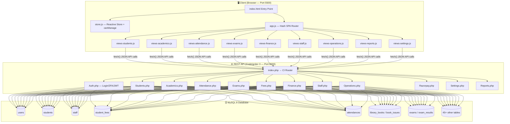

### File Structure

```
Smart-School-Management-System/
├── frontend/                          ← SPA Frontend
│   ├── index.html                     ← Entry point (loads all scripts)
│   ├── css/
│   │   └── style.css                  ← Complete design system
│   ├── js/
│   │   ├── store.js                   ← Reactive store, canManage(), modal engine
│   │   ├── app.js                     ← SPA router, auth, API client, nav
│   │   ├── views-students.js          ← Students, Admission, TC, Credentials
│   │   ├── views-academics.js         ← Calendar, Downloads, Timetable, Live Classes
│   │   ├── views-attendance.js        ← Mark, QR, Report
│   │   ├── views-exams.js             ← Exams, Marks Entry, Admit Cards
│   │   ├── views-finance.js           ← Fees, Payroll, Accounts, Razorpay
│   │   ├── views-staff.js             ← Staff directory, Leave, Payslips
│   │   ├── views-operations.js        ← Library, Transport, Hostel, Notices
│   │   ├── views-reports.js           ← Analytics and Reports
│   │   └── views-settings.js          ← School settings, RBAC, Custom Fields
│   └── assets/
│       └── favicon.jpg
│
├── backend_codeigniter/               ← REST API Backend
│   └── application/
│       ├── controllers/               ← 15 controllers
│       ├── models/                    ← 10 models
│       └── config/
│           ├── database.php           ← MySQL connection
│           └── routes.php             ← API route mappings
│
├── database/
│   └── smart_school_database_cpanel_2026.sql  ← Full DB dump (56 tables)
│
├── index.php                          ← Apache root → CI bootstrap
├── .htaccess                          ← mod_rewrite rules
└── .env.example                       ← Environment config template
```

---

## 4. Application Working Flow

### 4.1 Authentication Flow

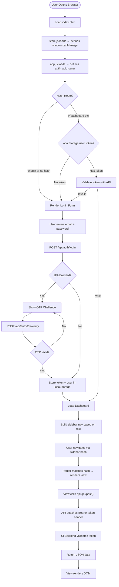

### 4.2 SPA Navigation Flow

```mermaid
flowchart LR
    A[User clicks nav item] --> B["window.location.hash = '#/route'"]
    B --> C["hashchange event fires"]
    C --> D["router() function in app.js"]
    D --> E["Matches route in routeMap"]
    E --> F["Calls viewFn() — async function"]
    F --> G["Fetches data from API"]
    G --> H["Returns HTML template string"]
    H --> I["document.getElementById('app').innerHTML = html"]
    I --> J["attachEventListeners()"]
    J --> K[UI is live and interactive]
```

---

## 5. Module Flowcharts

### 5.1 Fee Collection Flow (with Razorpay)

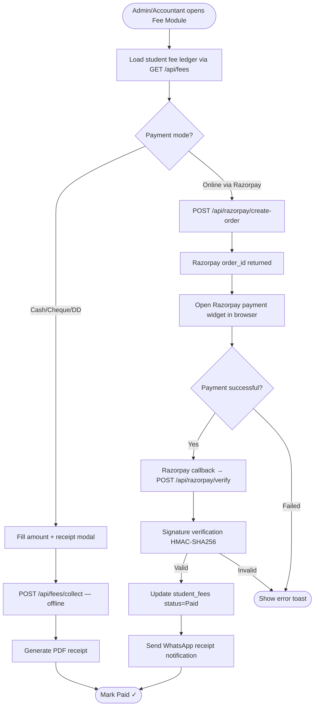

### 5.2 Library Book Issue & Return Flow

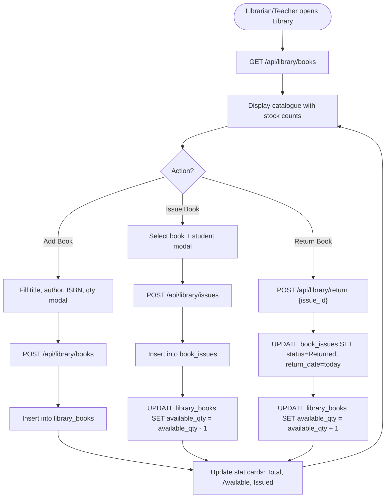

### 5.3 Attendance Flow (Manual + QR)

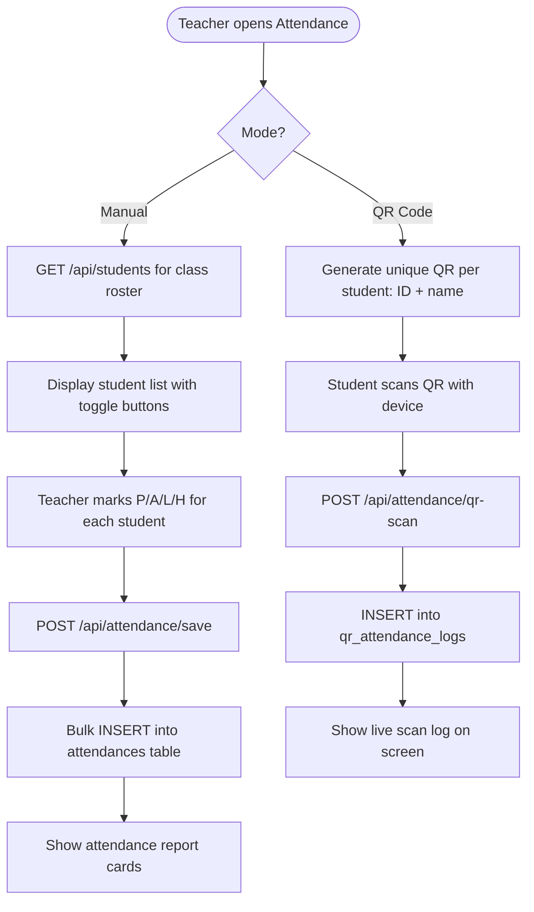

### 5.4 Exam & Marks Flow

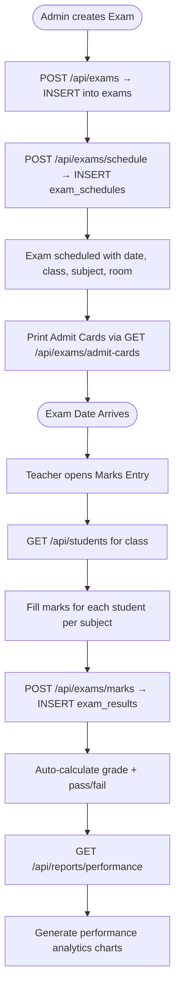

### 5.5 Student Admission Flow

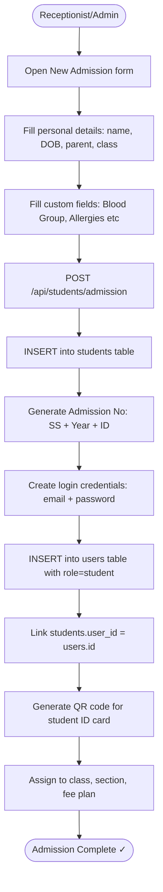

---

## 6. Database ER Diagram

### 6.1 Core Entity Relationships

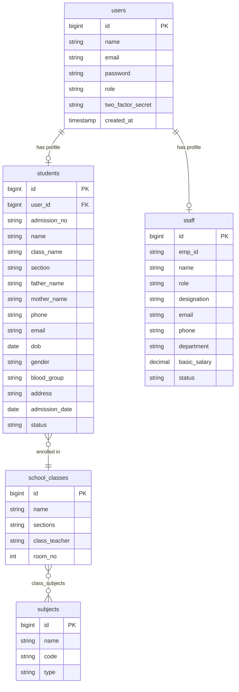

### 6.2 Academic & Examination Relationships

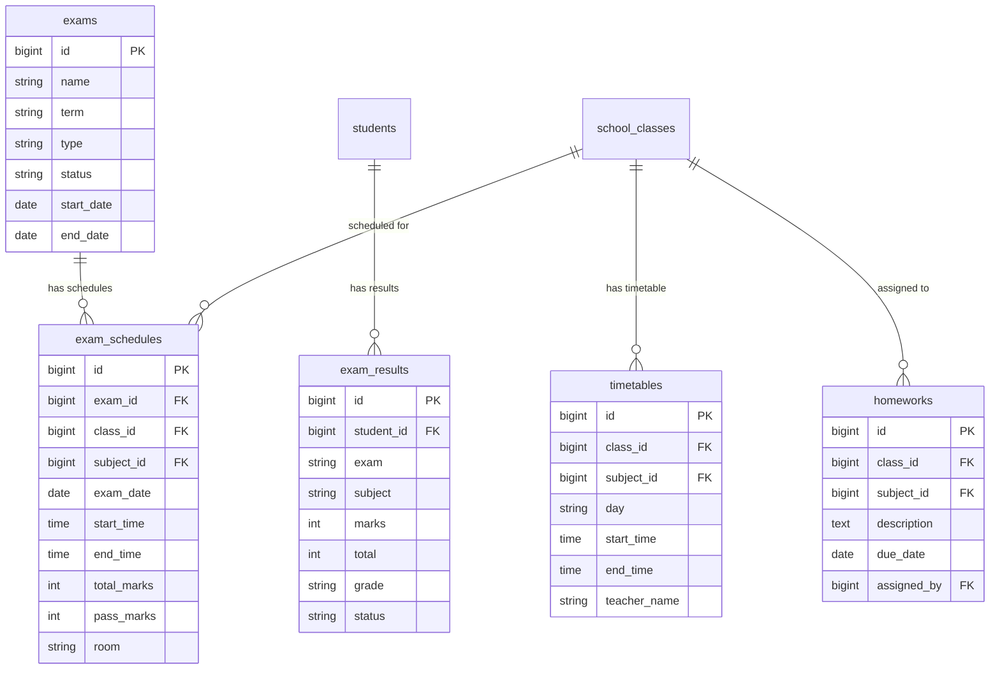

### 6.3 Finance & Fee Relationships

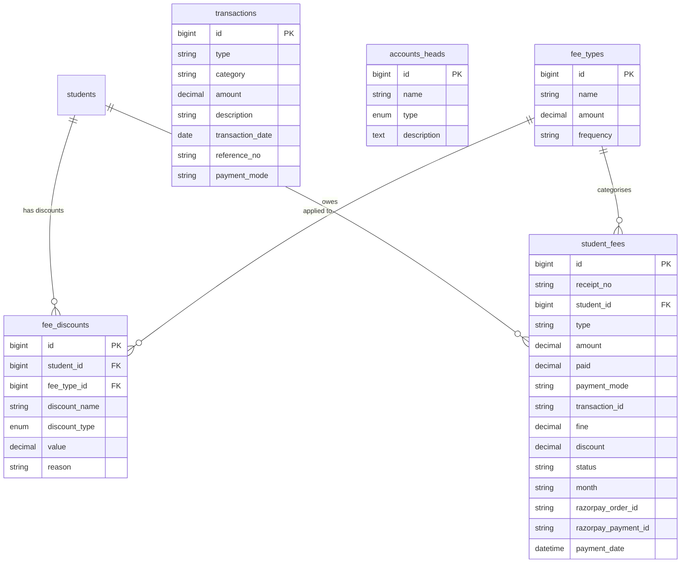

### 6.4 Library Relationships

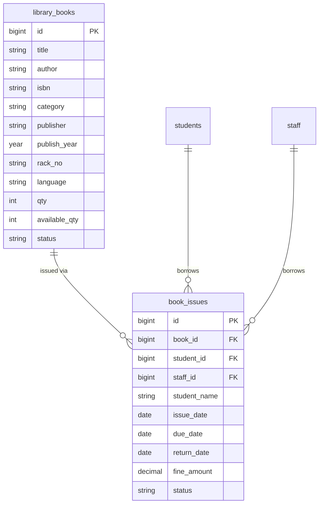

### 6.5 Operations Relationships

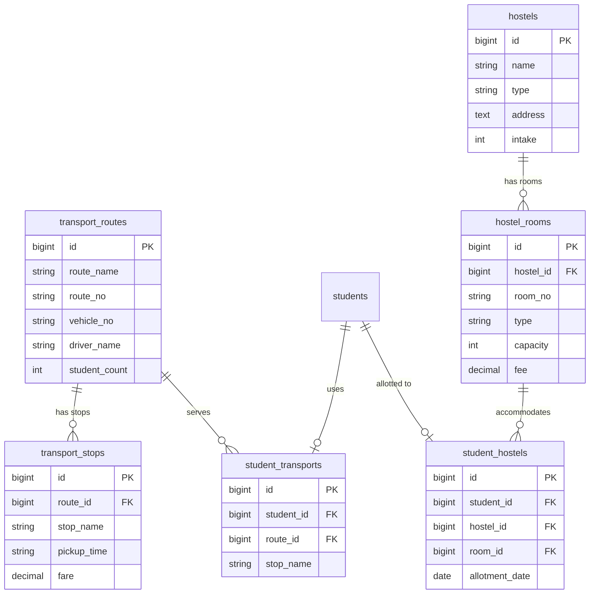

### 6.6 Attendance & Communication Relationships

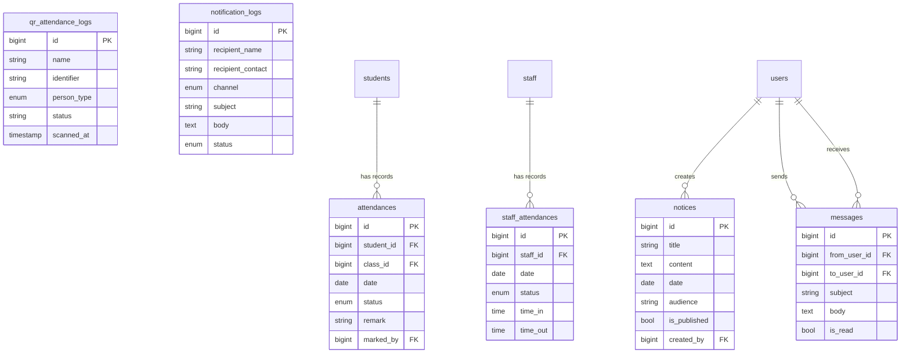

### 6.7 RBAC Relationships

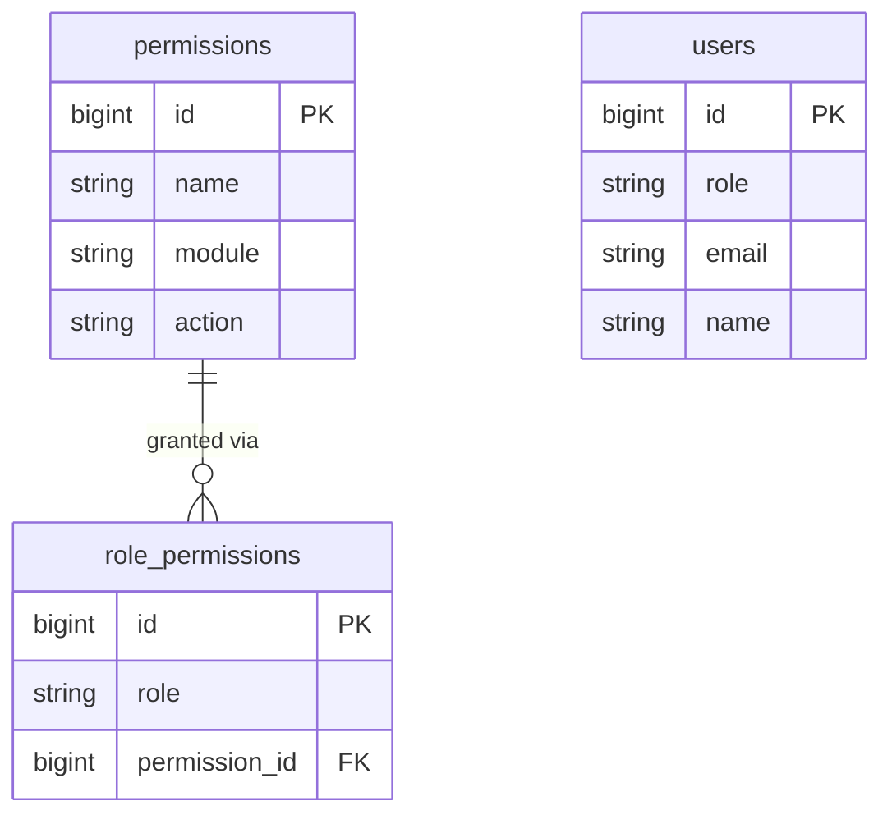

---

## 7. Role-Based Access Control (RBAC)

### Role Permission Matrix

| Module / Action | Super Admin | Admin | Teacher | Accountant | Librarian | Receptionist | Parent | Student |
|----------------|:-----------:|:-----:|:-------:|:----------:|:---------:|:------------:|:------:|:-------:|
| Students — View | ✅ | ✅ | ✅ | | | ✅ | | |
| Students — Create/Edit/Delete | ✅ | ✅ | | | | ✅ | | |
| New Admission | ✅ | ✅ | | | | ✅ | | |
| Transfer Certificate | ✅ | ✅ | | | | | | |
| Staff — View | ✅ | ✅ | | | | | | |
| Staff — Create/Edit/Delete | ✅ | ✅ | | | | | | |
| Mark Attendance | ✅ | ✅ | ✅ | | | | | |
| QR Attendance | ✅ | ✅ | ✅ | | | ✅ | | |
| Attendance Report | ✅ | ✅ | ✅ | | | | | |
| Examinations | ✅ | ✅ | ✅ | | | | ✅ | ✅ |
| Marks Entry | ✅ | ✅ | ✅ | | | | | |
| Admit Card | ✅ | ✅ | ✅ | | | | ✅ | ✅ |
| Fee Collect / View | ✅ | ✅ | | ✅ | | | | |
| Razorpay Payments | ✅ | ✅ | | ✅ | | | | |
| Annual Calendar — View | ✅ | ✅ | ✅ | | | | ✅ | ✅ |
| Annual Calendar — Add/Delete | ✅ | ✅ | ✅ | | | | ❌ | ❌ |
| Download Center — View/Download | ✅ | ✅ | ✅ | | | | ✅ | ✅ |
| Download Center — Upload/Delete | ✅ | ✅ | ✅ | | | | ❌ | ❌ |
| Live Classes — View/Join | ✅ | ✅ | ✅ | | | | ✅ | ✅ |
| Live Classes — Schedule/Delete | ✅ | ✅ | ✅ | | | | ❌ | ❌ |
| Library — View | ✅ | ✅ | ✅ | | ✅ | | | ✅ |
| Library — Issue/Return/Add | ✅ | ✅ | ✅ | | ✅ | | | ❌ |
| Transport — View | ✅ | ✅ | | | | | ✅ | ✅ |
| Transport — Manage | ✅ | ✅ | | | | | ❌ | ❌ |
| Hostel — View/Manage | ✅ | ✅ | | | | | | |
| Notices — View | ✅ | ✅ | ✅ | | | | ✅ | ✅ |
| Notices — Create/Edit | ✅ | ✅ | ✅ | | | | | |
| Payroll — View | ✅ | ✅ | | ✅ | | | | |
| Payroll — Generate/Pay | ✅ | ✅ | | ✅ | | | | |
| Reports | ✅ | ✅ | | ✅ | | | | |
| Settings | ✅ | | | | | | | |

### RBAC Implementation

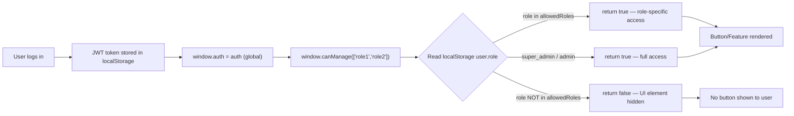

---

## 8. API Architecture

### Base URL & Structure
```
Backend: http://127.0.0.1:8000/api/
Frontend: http://127.0.0.1:5500/frontend/
```

### Key API Endpoints

| Method | Endpoint | Controller | Description |
|--------|----------|------------|-------------|
| POST | `/api/auth/login` | Auth | Login with email + password |
| POST | `/api/auth/2fa-verify` | Auth | Two-factor OTP verification |
| POST | `/api/auth/logout` | Auth | Invalidate token |
| GET | `/api/students` | Students | List all students |
| POST | `/api/students` | Students | Create new student |
| PUT | `/api/students/{id}` | Students | Update student record |
| DELETE | `/api/students/{id}` | Students | Delete student |
| GET | `/api/staff` | Staff | List all staff members |
| POST | `/api/attendance/save` | Attendance | Bulk save attendance |
| POST | `/api/attendance/qr-scan` | Attendance | Log QR scan |
| GET | `/api/attendance/report` | Attendance | Attendance analytics |
| GET | `/api/exams` | Exams | List examinations |
| POST | `/api/exams/marks` | Exams | Save marks batch |
| GET | `/api/fees` | Fees | Student fee ledger |
| POST | `/api/fees/collect` | Fees | Record offline payment |
| POST | `/api/razorpay/create-order` | Razorpay | Create online payment |
| POST | `/api/razorpay/verify` | Razorpay | Verify payment signature |
| GET | `/api/library/books` | Operations | Book catalogue |
| POST | `/api/library/books` | Operations | Add new book |
| POST | `/api/library/issues` | Operations | Issue book to student |
| POST | `/api/library/return` | Operations | Return book |
| GET | `/api/library/issues` | Operations | Circulation ledger |
| GET | `/api/transport/routes` | Operations | Bus routes |
| GET | `/api/hostel/rooms` | Operations | Hostel rooms |
| GET | `/api/calendar-events` | Academics | Annual calendar |
| POST | `/api/calendar-events` | Academics | Add event |
| GET | `/api/download-materials` | Academics | Study materials |
| POST | `/api/download-materials` | Academics | Upload material |
| GET | `/api/live-classes` | Academics | Live class schedule |
| GET | `/api/notices` | Operations | Notice board |
| GET | `/api/reports/dashboard` | Dashboard | KPI dashboard stats |
| GET | `/api/settings` | Settings | School configuration |
| POST | `/api/settings` | Settings | Update settings |
| GET | `/api/payroll` | Finance | Staff payroll |
| POST | `/api/payroll/generate` | Finance | Generate salary |

### API Response Format
```json
{
  "status": "success",
  "data": [...],
  "message": "Operation completed successfully",
  "total": 42
}
```

---

## 9. Module Catalogue (45 Modules)

### 🎓 Student Management
1. **Student Directory** — Full profile, search, filters
2. **New Admission** — Complete admission workflow with custom fields
3. **Login Credentials** — Generate username/password for students/parents
4. **Student Promotion** — Bulk class promotion at year end
5. **Transfer Certificate** — Automated TC generation
6. **Behavior Records** — Incident logging per student
7. **Student Documents** — Upload & manage certificates, birth cert, etc.

### 👨‍🏫 Staff Management
8. **Staff Directory** — Complete HR records
9. **Staff Attendance** — Daily time-in/time-out with status
10. **Leave Applications** — Leave approval workflow
11. **Payroll** — Salary generation, payslips, payment tracking

### 📅 Academic Management
12. **Classes & Sections** — Class structure management
13. **Subjects** — Subject catalogue with class mapping
14. **Academic Sessions** — Year management (active session)
15. **Timetable** — Weekly class timetable per class
16. **Annual Calendar** — School events, holidays, exams
17. **Homework** — Assignment distribution per class/subject

### ✅ Attendance
18. **Mark Attendance** — Manual per-student P/A/L/H
19. **QR Code Attendance** — Scan-based attendance with live log
20. **Attendance Report** — Class-wise and student-wise analytics

### 📝 Examinations
21. **Examinations** — Create and schedule exams
22. **Marks Entry** — Subject-wise marks, auto-grade
23. **Admit Cards** — Student admit card generation and print
24. **Results** — Result cards with grade analysis

### 💰 Finance
25. **Fee Types** — Tuition, Transport, Hostel, Library fees
26. **Fee Collection** — Per-student payment with receipt
27. **Fee Discounts** — Sibling, merit, and scholarship discounts
28. **Razorpay Online Payment** — Integrated online payment gateway
29. **Accounts / Transactions** — Income/expense ledger
30. **Financial Reports** — Revenue analytics and export

### 📚 Library
31. **Book Catalogue** — Full inventory with stock tracking
32. **Book Issue** — Issue with due date and fine calculation
33. **Book Return** — Return and auto-increment available stock
34. **Circulation Ledger** — All issued/returned history

### 🚌 Operations
35. **Transport Routes** — Bus routes with stops and fares
36. **Hostel** — Building, rooms, student allotments
37. **Circular / Notices** — Published announcements per audience
38. **Noticeboard** — School-wide notice management

### 🎥 Digital Learning
39. **Download Center** — Study material upload and download
40. **Live Classes** — Google Meet / Zoom class scheduling and join

### 📊 Reports & Analytics
41. **Dashboard KPIs** — Real-time summary cards
42. **Attendance Analytics** — Charts and export
43. **Financial Analytics** — Revenue, collection rates
44. **Academic Performance** — Student rank, grade distribution

### ⚙️ System Administration
45. **School Settings** — Profile, campus, Razorpay config, WhatsApp, RBAC, Custom Fields

---

## 10. Key Design Decisions

### 10.1 SPA Architecture
The frontend is a **Single Page Application** using **hash-based routing** (`#/students`, `#/exams`, etc.) with no framework. This decision was made for:
- Zero build step needed — works as static files
- Easy cPanel deployment (no Node.js server needed for frontend)
- Fast navigation without page reloads

### 10.2 Reactive Store
`window.SS_STORE` provides localStorage-backed reactive state that:
- Persists data across page refreshes as a fallback to the API
- Allows optimistic UI updates before API confirms
- Reduces redundant API calls with in-memory caching

### 10.3 Token-Based Auth with 2FA
- JWT-style Bearer token stored in `localStorage`
- All API requests attach `Authorization: Bearer <token>` header
- Optional TOTP-based two-factor authentication for admin accounts

### 10.4 Offline Fallback Strategy
Each view function follows this pattern:
1. Try to fetch from MySQL via REST API
2. On API failure → fall back to `SS_STORE` localStorage data
3. UI always renders — never blank due to API failure

### 10.5 Razorpay Payment Integration
- Server creates `order_id` via Razorpay API (backend secret key protected)
- Frontend opens Razorpay checkout widget
- On success, `payment_id` + `signature` sent to backend for HMAC-SHA256 verification
- Only after verification is `student_fees.status` updated to `Paid`

---

## 11. Deployment Architecture

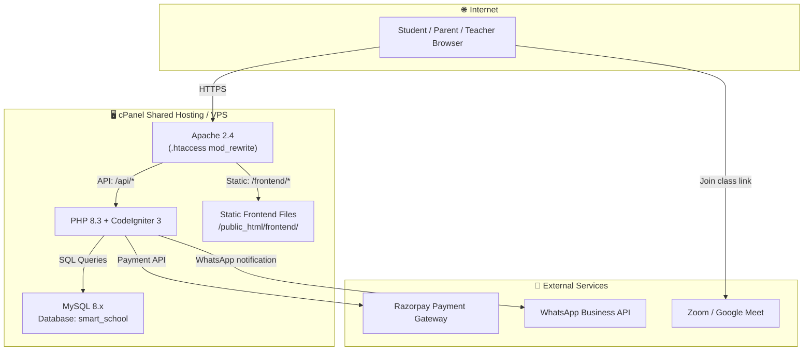

### Environment Configuration (`.env`)
```ini
DB_HOST=localhost
DB_DATABASE=smart_school
DB_USERNAME=smart_school_user
DB_PASSWORD=<secure_password>

RAZORPAY_KEY_ID=rzp_live_XXXXXXXX
RAZORPAY_KEY_SECRET=XXXXXXXXXXXXXXXX
RAZORPAY_MODE=live

WHATSAPP_NUMBER=+919876543210
```

---

## Appendix: Complete Database Table Index

| # | Table Name | Purpose |
|---|-----------|---------|
| 1 | `users` | System user accounts & authentication |
| 2 | `students` | Student profiles & admission records |
| 3 | `staff` | Employee HR records |
| 4 | `school_classes` | Class & section configuration |
| 5 | `subjects` | Subject catalogue |
| 6 | `class_subjects` | Class ↔ Subject mapping |
| 7 | `academic_sessions` | Academic year management |
| 8 | `timetables` | Weekly class schedules |
| 9 | `homeworks` | Teacher-assigned homework |
| 10 | `attendances` | Student daily attendance |
| 11 | `staff_attendances` | Staff daily attendance |
| 12 | `qr_attendance_logs` | QR scan attendance log |
| 13 | `exams` | Examination master records |
| 14 | `exam_schedules` | Per-class exam schedule |
| 15 | `exam_results` | Student marks & grades |
| 16 | `fee_types` | Fee category definitions |
| 17 | `student_fees` | Individual fee records & payments |
| 18 | `fee_discounts` | Scholarship & concession records |
| 19 | `transactions` | General income/expense ledger |
| 20 | `accounts_heads` | Chart of accounts |
| 21 | `salary_records` | Monthly payroll records |
| 22 | `payslip_items` | Individual payslip line items |
| 23 | `library_books` | Book catalogue & inventory |
| 24 | `book_issues` | Book issue & return ledger |
| 25 | `transport_routes` | Bus route master |
| 26 | `transport_stops` | Bus stop schedule |
| 27 | `student_transports` | Student ↔ Route assignment |
| 28 | `hostels` | Hostel building records |
| 29 | `hostel_rooms` | Room configuration |
| 30 | `student_hostels` | Student room allotment |
| 31 | `calendar_events` | Annual academic calendar |
| 32 | `download_materials` | Study material uploads |
| 33 | `live_classes` | Live online class schedule |
| 34 | `notices` | School circular notices |
| 35 | `messages` | Internal staff messaging |
| 36 | `notification_logs` | SMS/Email/Push log |
| 37 | `leave_applications` | Staff & student leave requests |
| 38 | `permissions` | Permission definitions (44 permissions) |
| 39 | `role_permissions` | Role ↔ Permission mapping |
| 40 | `custom_fields` | Dynamic admission form fields |
| 41 | `student_custom_field_values` | Custom field data per student |
| 42 | `student_documents` | Scanned documents per student |
| 43 | `student_promotions` | Year-end promotion records |
| 44 | `student_siblings` | Sibling relationship for discounts |
| 45 | `student_timelines` | Student academic timeline events |
| 46 | `student_notes` | Teacher notes on students |
| 47 | `school_settings` | System-wide configuration |
| 48 | `personal_access_tokens` | Bearer token store |
| 49 | `password_reset_tokens` | Password reset links |
| 50 | `sessions` | PHP session storage |
| 51 | `cache` | Application cache store |
| 52 | `cache_locks` | Cache lock management |
| 53 | `jobs` | Background job queue |
| 54 | `job_batches` | Batch job tracking |
| 55 | `failed_jobs` | Failed job archive |
| 56 | `migrations` | Database version tracking |

---

*Report generated: September 29, 2026 | Infosof Technologies | Smart School Management System v1.5*
